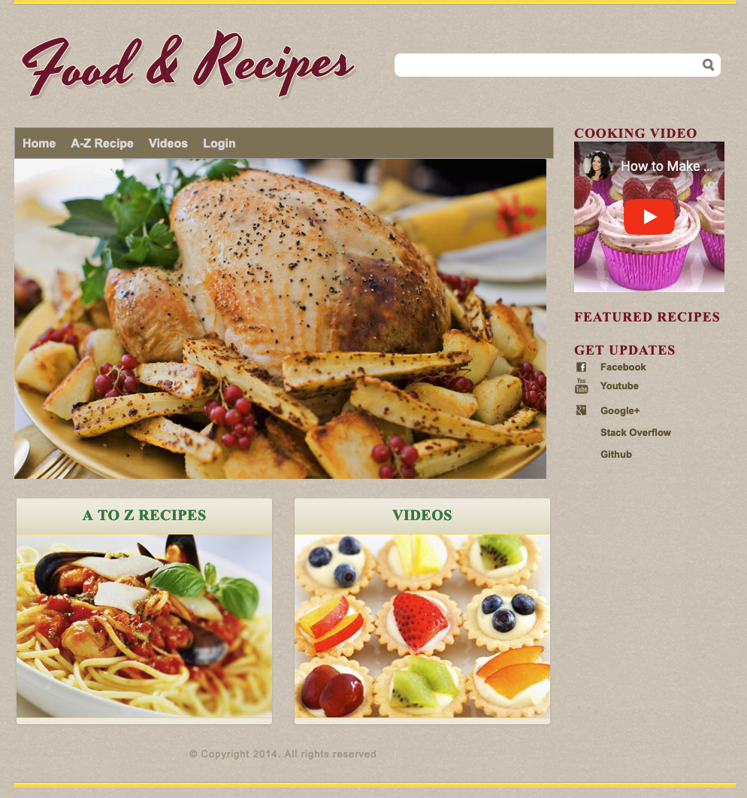

# Yummy-Foods
YummyFoods. Es una aplicación web basada en Spring 3.0, Hibernate 3.0 alojada en Jetty. Se trata básicamente de una aplicación donde el usuario puede publicar su receta y puede ver las recetas publicadas por otros usuarios. Sólo un usuario registrado puede publicar la receta, puede proporcionar calificaciones a otras recetas. Validación de front end, back end validación se utilizan junto con cualquier otro tipo de excepción que puede ocurrir y si un usuario va para una mala url que vendrá a la página de error genérico en lugar de dar error 404. La tecnología AJAX se implementa para hacer llamadas asíncronas para asignar la calificación a las recetas. El usuario recibe un correo de bienvenida una vez que se registra en la aplicación, también puede restablecer su contraseña utilizando la opción Olvidé mi contraseña de la página de inicio de sesión, en este caso se enviará un correo a su dirección de correo electrónico con los detalles de la contraseña. Mailgun-api se utiliza (basado en el cliente jersey) para realizar estas acciones.

## Autor original
[Pulkit](https://github.com/pulkitsharva)

## Pre-requisitos
* Java 8
* Jetty
* Mysql

## Construcción :hammer:

### MySql (Docker)
Se puede crear una base de datos docker mediante los siguientes comandos
```bash
docker pull mysql:5.5.42
docker network create mysql-net
docker run --network mysql-net --name yummy-mysql -p 3306:3306 -e MYSQL_ROOT_PASSWORD=password -d mysql:5.5.42
```

Para ejecutar comandos en MySql
```bash
docker run --network mysql-net -it --rm mysql mysql -hyummy-mysql -uroot -p
```

> [!NOTE]
> Es necesario ejecutar los comandos [schema.sql](assets/schema.sql) para que la aplicación funcione correctamente.

### Aplicación

Ejecutar el siguiente comando para construir el archivo `.war`
```bash
mvn clean package
```

## Ejecución :arrow_forward:

```bash
mvn tomcat7:run
```

La applicación se podrá acceder en http://localhost:8080/YummyFoods


