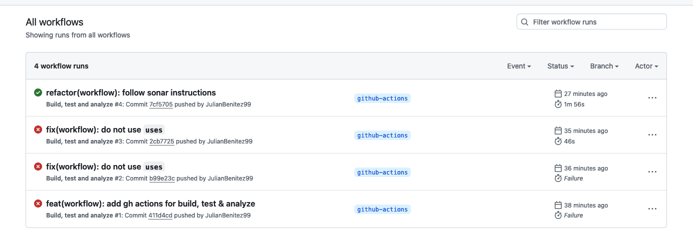
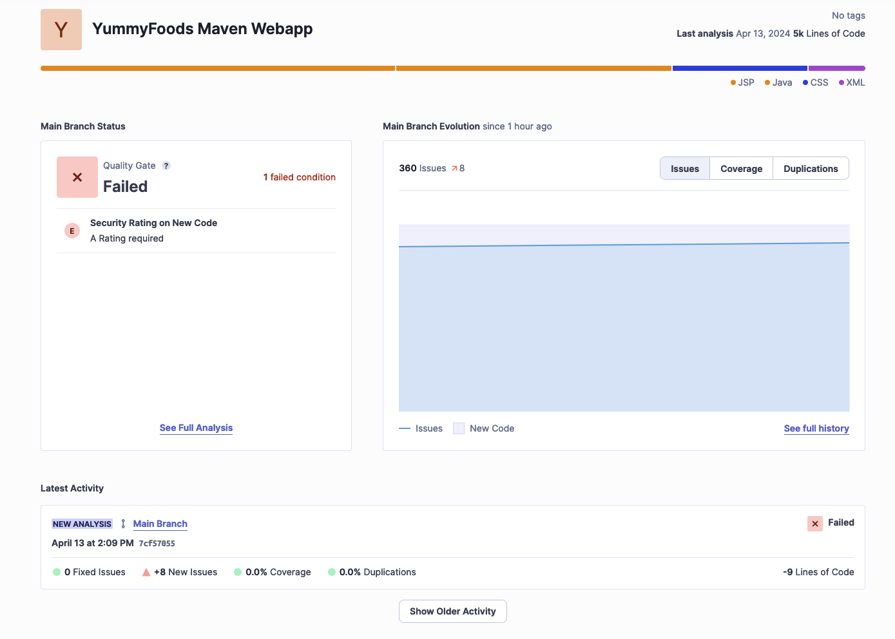
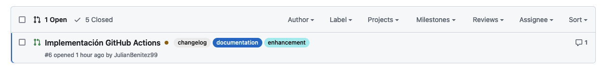

# GitHub Actions para CI

Se agregaron los siguientes archivos para la configuración de GitHub Actions:
* `.github/workflows/build-test-analyze.yml`: Configuración para la ejecución de pruebas unitarias, construcción del proyecto y análisis estático de código.
* `.github/workflows/add-labels.yml`: Para agregar etiquetas a los issues y pull requests automáticamente.

## SonarCloud
La primera ejecución de la acción mostró el siguiente resultado con un error en el `Quality Gate` en seguridad.

Se puede ver el resultado en [SonarCloud](https://sonarcloud.io/project/overview?id=cdst-jb_YummyFoods).

## Etiquetas (Labels)
Las etiquetas se agregan automáticamente a los issues y pull requests son una forma de categorizarlos y facilitar su seguimiento.

## Conclusiones
GitHub Actions nos brinda la posibilidad de implementar integración continua, junto con otras formas de automatización, lo que permite al equipo de desarrollo evitar errores y garantizar que el código cumpla con los estándares de calidad establecidos.