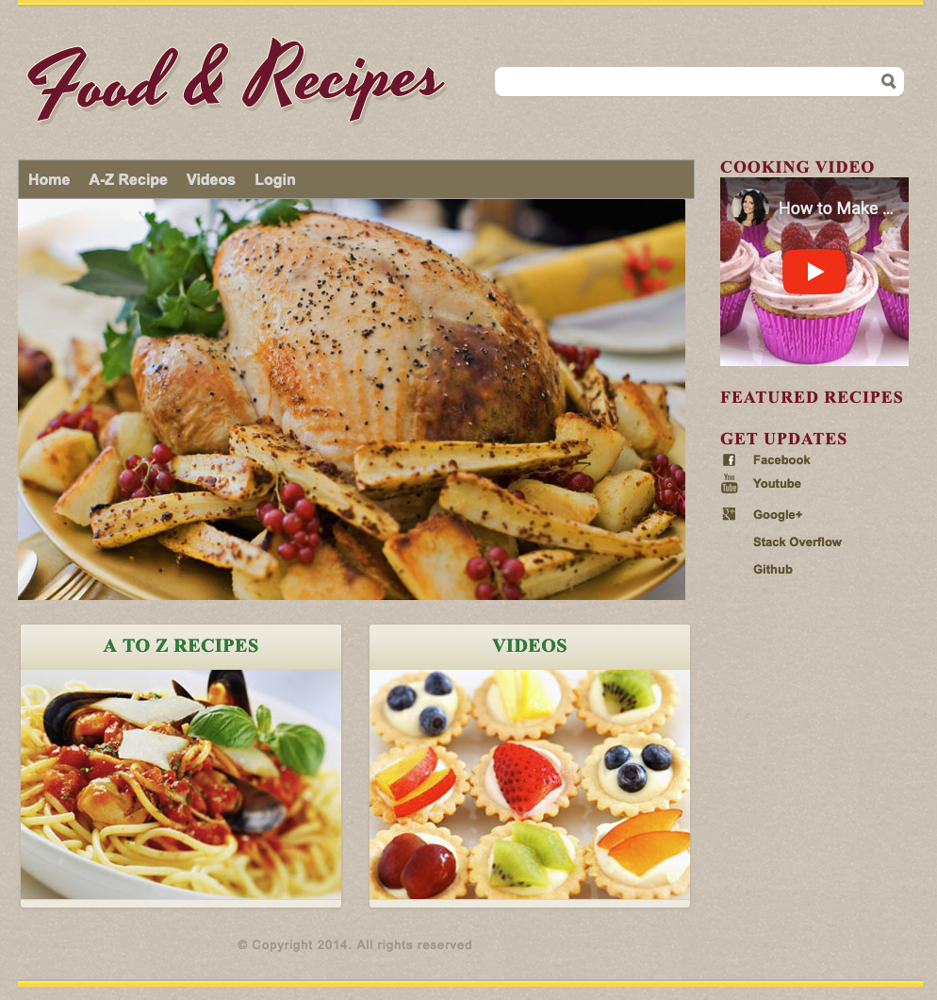

# Yummy Foods

Se trata de una aplicación donde el usuario puede publicar su receta y puede ver las recetas publicadas por otros usuarios. 
Solo un usuario registrado puede publicar la receta, puede proporcionar calificaciones a otras recetas. Validación de 
front end, back end validación se utilizan junto con cualquier otro tipo de excepción que puede ocurrir y si un usuario 
va para una mala url que vendrá a la página de error genérico en lugar de dar error 404.

La tecnología AJAX se implementa 
para hacer llamadas asíncronas para asignar la calificación a las recetas. El usuario recibe un correo de bienvenida una
vez que se registra en la aplicación, también puede restablecer su contraseña utilizando la opción Olvidé mi contraseña 
de la página de inicio de sesión, en este caso se enviará un correo a su dirección de correo electrónico con los detalles
de la contraseña. Mailgun-api se utiliza (basado en el cliente jersey) para realizar estas acciones.

## Índice
* ♻️ [Code Smells y Técnicas de Refactoring](codesmells-refactor-techniques)
* 🧼 [Clean Code + XP Practices](clean-code-xp-practices.md)
* ✔️ [Testing Debt](TestingDebt.md)
* 🔍 [Análisis Estático](static-analysis.md)
* 🤖 [DevExp + AI](devexp-ai.md)
* 👾 [GitHub Actions](github-actions.md)
* 👃 [Architectural Smells](ArchitecturalSmells.md)