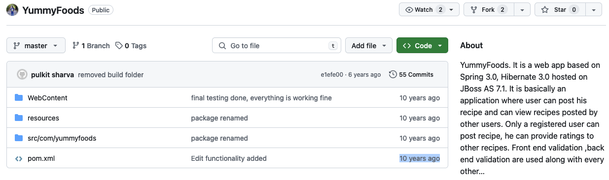
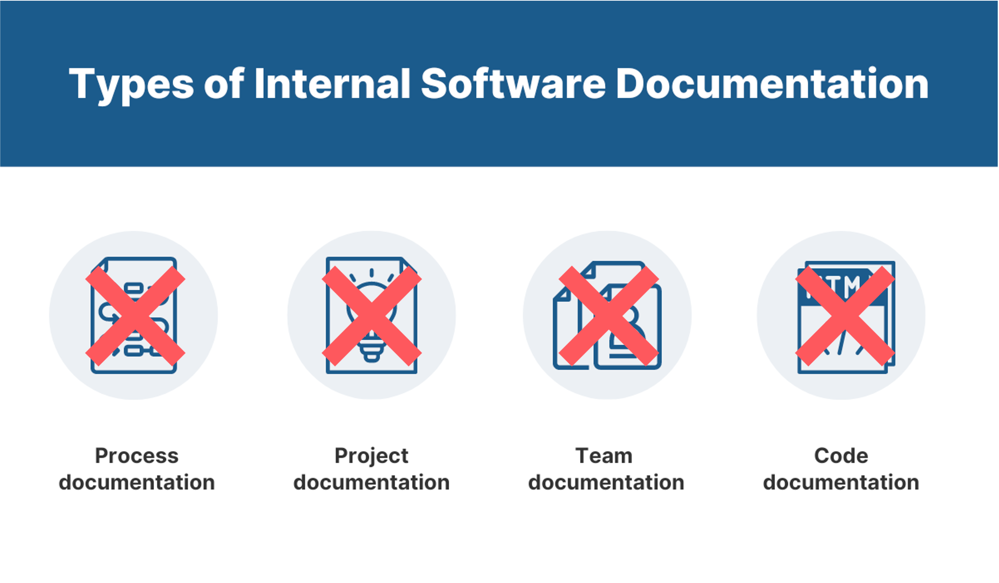
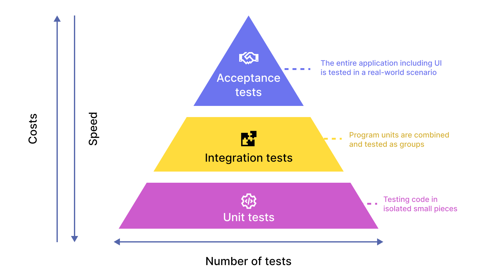

# 📖 Ausencia de Documentación
-----
{:.centered}

{:.centered}

* **¿Cómo ejecutar el proyecto?**
* **Estructura del proyecto**
* **Diagramas**
* **Imágenes**
* **No hay forma de saber qué base de datos ni qué versión se utilizó**

# 🕰️ Complejidad Legacy
-----


{:.centered}

#### Versiones
```xml
<properties>
    <spring.version>3.0.5.RELEASE</spring.version>
    <hibernate.version>3.5.1-Final</hibernate.version>
    <junit.version>4.11</junit.version>
    <jdk.version>1.6</jdk.version>
</properties>
```

#### Problemas
* **No había servidor embebido**
* **No había esquema SQL**
* **Uso de versiones no disponibles**
* **Despliegue manual**

# ⚠️ Code Smells
-----
* **Problemas de seguridad**
```java
login = (Login) session.createQuery("from Login where userId='"+userId+"'").list().get(0);
```
```java
client.addFilter(new HTTPBasicAuthFilter("api", "key-87gm0tkpfhb1eel7q7regznhf75ntl44"));
```
* **Identación, literales, y lógica**
```java
for(int i=0;i<paginationRecipeList.size();i++)
{
    int length=paginationRecipeList.get(i).getDirections().length();
    if(length<275)
    {

    }
    else
    {
        paginationRecipeList.get(i).setDirections(paginationRecipeList.get(i).getDirections().substring(0,275));
    }
}
```

# ❌ Unit Tests
-----

* **No existían pruebas**
```text
final testing done, everything is working fine
```

[anterior](index.md) | [siguiente](presentation2.md)