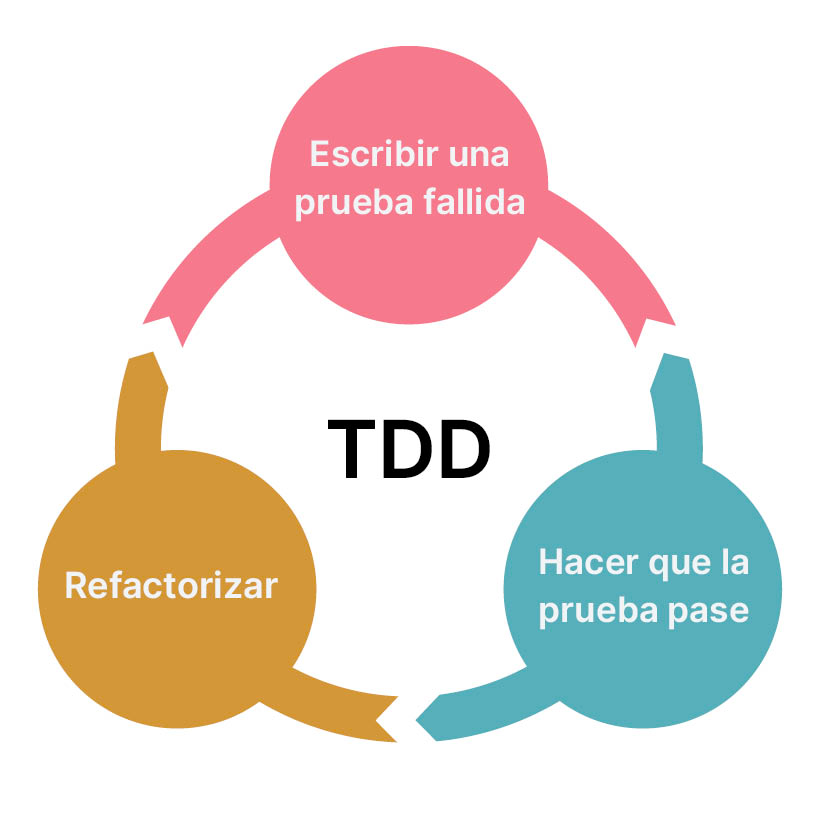

{:.centered}

# ✅ Unit Testing
-----



```maven
[INFO] -------------------------------------------------------
[INFO]  T E S T S
[INFO] -------------------------------------------------------
[INFO] Running com.yummyfoods.spring.validator.UserChangePasswordValidatorTest
log4j:WARN No appenders could be found for logger (org.springframework.beans.BeanUtils).
log4j:WARN Please initialize the log4j system properly.
[INFO] Tests run: 2, Failures: 0, Errors: 0, Skipped: 0, Time elapsed: 0.069 s -- in com.yummyfoods.spring.validator.UserChangePasswordValidatorTest
[INFO] Running com.yummyfoods.spring.dao.UserDAOImplTest
OpenJDK 64-Bit Server VM warning: Sharing is only supported for boot loader classes because bootstrap classpath has been appended
[WARNING] Tests run: 6, Failures: 0, Errors: 0, Skipped: 1, Time elapsed: 0.681 s -- in com.yummyfoods.spring.dao.UserDAOImplTest
[INFO] 
[INFO] Results:
[INFO] 
[WARNING] Tests run: 8, Failures: 0, Errors: 0, Skipped: 1
[INFO] 
[INFO] ------------------------------------------------------------------------
[INFO] BUILD SUCCESS
[INFO] ------------------------------------------------------------------------
[INFO] Total time:  2.938 s
[INFO] Finished at: 2024-05-01T15:47:38-05:00
[INFO] ------------------------------------------------------------------------
```

# ♻️ Refactoring
-----

* **Seguridad en sentencias SQL**
```java
login = (Login) session.createQuery("from Login where userId='"+userId+"'").list().get(0);
```
```java
login = (Login) session.createQuery("from Login where userId= :userId")
                       .setParameter("userId", userId)
                       .uniqueResult();
```
* **Seguridad de llaves privadas**
```java
client.addFilter(new HTTPBasicAuthFilter("api", "key-87gm0tkpfhb1eel7q7regznhf75ntl44"));
```
```java
@Value("${email.api.url}")
private String EMAIL_API_URL;
@Value("${email.api.key:#{null}")
private String EMAIL_API_KEY;
@Value("${email.api.username}")
private String EMAIL_API_USERNAME;
```

[anterior](presentation1.md) | [siguiente](presentation3.md) 