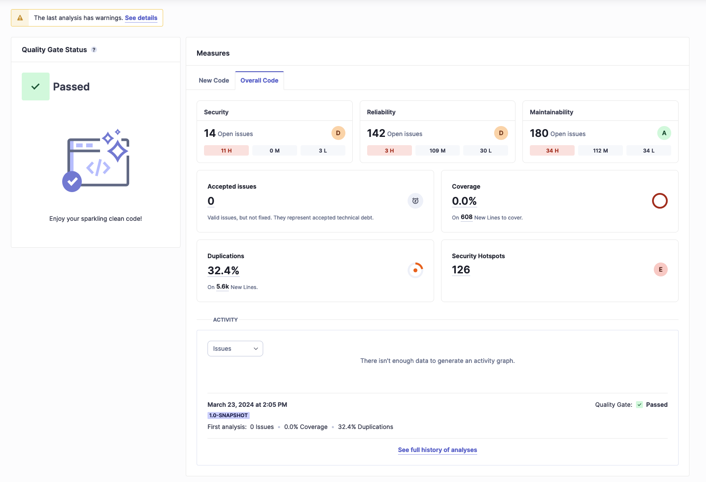
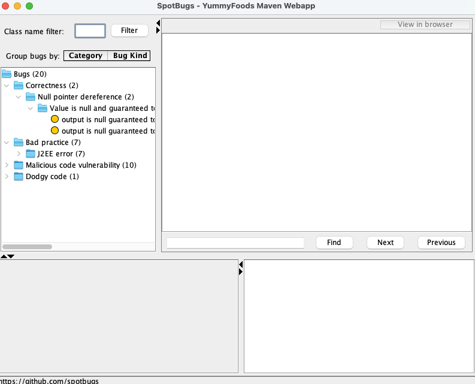

# 🔎 SonarQube
-----

{:.centered}

#### 🧬 Issues
**318 issues con un esfuerzo de 5d 5h**

#### 📚 Código duplicado
**Se encontró un 32.4% de código duplicado en 5.6k líneas de código.**

#### 🔓 Seguridad
**Se encontraron 14 problemas de seguridad**

#### 🧪  Mantenibilidad
**Se encontraron 180 problemas de mantenibilidad**

#### 📉 Fiabilidad
**Se encontraron 142 problemas de fiabilidad**

# 🐛 SpotBugs
-----
```xml
<dependency>
    <groupId>com.github.spotbugs</groupId>
    <artifactId>spotbugs</artifactId>
    <version>${version}</version>
</dependency>
```

{:.centered}

#### 🐛 Bugs
* `NP_GUARANTEED_DEREF_ON_EXCEPTION_PATH` - `NullPointerException` garantizada en un camino de excepción.
* `J2EE_STORE_OF_NON_SERIALIZABLE_OBJECT_INTO_SESSION` - Almacenar un objeto no serializable en la sesión.
* `EI_EXPOSE_REP` - Exponer un objeto mutable a un cliente.
* `UC_USELESS_CONDITION` - Condición sin efecto.


[anterior](presentation2.md) | [siguiente](presentation4.md)
