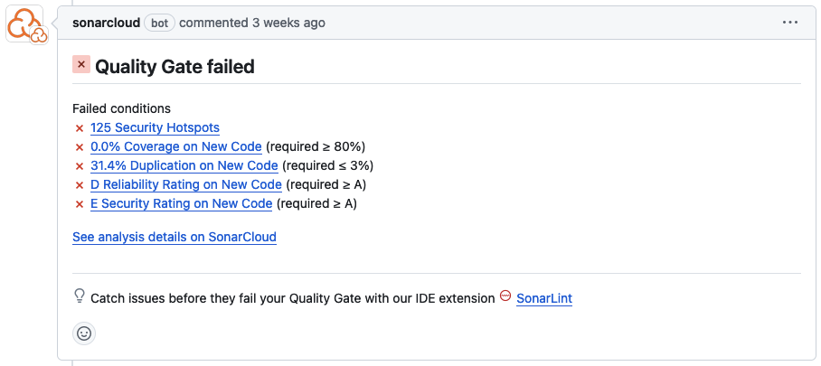

# ⚡ GitHub Actions
-----

{:.centered}

* **Build, Test and Analyze**

## ☁️ SonarCloud
* **La ejecución de la acción mostró el siguiente resultado con un error en el `Quality Gate` en seguridad.**

{:.centered}

{:.centered}

Resultado en [SonarCloud](https://sonarcloud.io/project/overview?id=cdst-jb_yummyfoodslocal).

## ❇️ Etiquetas (Labels)
* **Las etiquetas se agregan automáticamente a los issues y pull requests son una forma de categorizarlos y facilitar su seguimiento.**

{:.centered}

# 🖊️ GitHub Copilot
-----

## ❓ Preguntas sobre el Proyecto
* **Mediante GitHub Copilot Chat en el IDE, es posible realizar preguntas sobre el proyecto.**
```text
/explain LoginDAOImpl
```

{:.centered}

## ♻️ Refactorización de Código

* **Mediante GitHub Copilot se puede realizar la refactorización de código además de sugerir cambios en el código.**
```text
How can I refactor sendEmail to be more maintainable?
```

{:.centered}

1. Extraer constantes en archivos de configuración.
2. Manejo de excepciones, en este caso se sugiere lanzar una excepción propia en lugar de una excepción genérica.
3. Logging mediante la librería `log4j` o `slf4j`.
4. Inyección de dependencias para el objeto `Client`.

Incluso menciona que existe una vulnerabilidad en el código al dejar credenciales en el código.

## 📖 Documentación del Código

* **Mediante GitHub Copilot se puede generar documentación (javaDoc) para los métodos.**
```
/doc
```

{:.centered}


[anterior](presentation3.md) | [siguiente](presentation5.md)