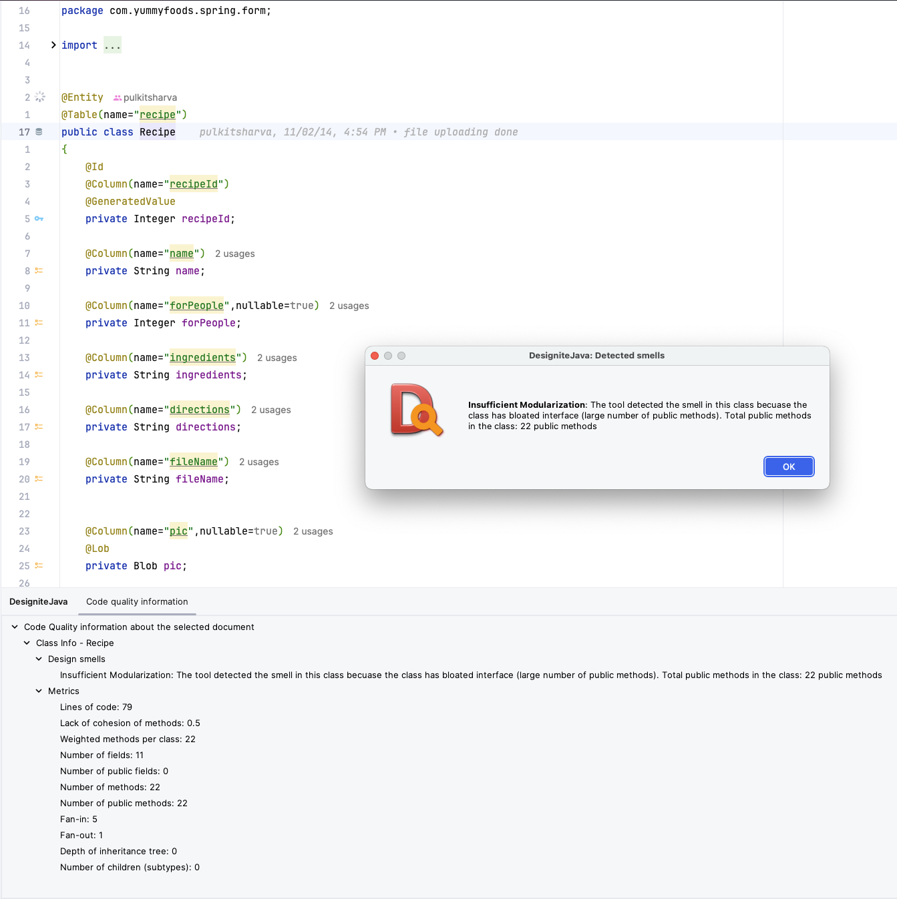

# Architectural Debt
La deuda arquitectónica tiende a ser más compleja y a tener un alcance mayor. 
Puede se haya utilizado algoritmos inadecuados o ineficaces que funcionan pero no bien. 
Estas cosas tienden a ser más complejas de arreglar y necesitamos asignarles tiempo en el calendario.
No son cosas que se deban decidir arreglar en el momento, sino que hay que planificarlas. 

Los "architectural smells" son estructuras no deseadas y anomalías en la arquitectura del software. 
Su presencia provoca un aumento de la deuda técnica, degrada la calidad del software y afecta a cuándo, dónde y cuánto se 
cambia el código.

## Designite
Es una herramienta que profundiza en descubrir meticulosamente una amplia gama de problemas de
mantenibilidad que abarcan problemas de arquitectura, diseño, pruebas, comprobabilidad e implementación.

La versión de la comunidad de Designite, que es gratuita, permite analizar proyectos Java y C# y proporciona una amplia 
gama de métricas y olores de código mediante un análisis estático al proyecto por medio de la línea de comandos.

```bash
java -jar designite.jar -i YummyFoods/ -o designite-scan/
```

Estos fueron los resultados obtenidos al analizar el proyecto YummyFoods con Designite.

### Olores de código en el diseño
|Package Name                    |Type Name                      |Code Smell                     |
|--------------------------------|-------------------------------|-------------------------------|
|com.yummyfoods.spring.validator |UserChangePasswordValidatorTest|Unutilized Abstraction         |
|com.yummyfoods.spring.dao       |UserDAOImplTest                |Unutilized Abstraction         |
|com.yummyfoods.spring.dao       |LoginDAOImpl                   |Unutilized Abstraction         |
|com.yummyfoods.spring.dao       |RecipeDAOImpl                  |Unutilized Abstraction         |
|com.yummyfoods.spring.servlet   |ImageServlet                   |Unutilized Abstraction         |
|com.yummyfoods.spring.form      |User                           |Cyclic-Dependent Modularization|
|com.yummyfoods.spring.form      |Login                          |Cyclic-Dependent Modularization|
|com.yummyfoods.spring.form      |Recipe                         |Insufficient Modularization    |
|com.yummyfoods.spring.controller|RecipeController               |Unutilized Abstraction         |
|com.yummyfoods.spring.controller|LoginController                |Unutilized Abstraction         |
|com.yummyfoods.spring.controller|UserController                 |Unutilized Abstraction         |
|com.yummyfoods.spring.service   |LoginServiceImpl               |Unutilized Abstraction         |
|com.yummyfoods.spring.service   |UserServiceImpl                |Unutilized Abstraction         |
|com.yummyfoods.spring.service   |RecipeServiceImpl              |Unutilized Abstraction         |

Dados los resultados anteriores algunas conclusiones que se pueden extraer sobre el estado del proyecto respecto a los
olores de código en el diseño son:

1. **Unutilized Abstraction**: La que está más presente, hay una serie de clases o componentes que se consideran abstracciones no utilizadas. 
Esto puede indicar que hay interfaces, clases abstractas o incluso capas arquitectónicas que no están siendo aprovechadas adecuadamente. Esto podría llevar a una complejidad innecesaria y dificultades en el mantenimiento.
2. **Cyclic-Dependent Modularization**: Existen dependencias cíclicas entre los componentes del sistema, como se ve en
las clases `User`, `Login` y `Recipe` dentro del paquete `com.yummyfoods.spring.form`. 
Haciendo que el sistema sea más difícil de entender, probar y mantener, ya que los cambios en uno de estos módulos pueden tener efectos inesperados en otros.
3. **Insufficient Modularization**: La clase Recipe dentro del paquete `com.yummyfoods.spring.form` se identifica como teniendo 
una modularización insuficiente. Esto puede significar que la clase es demasiado grande o hace demasiadas cosas, 
lo que dificulta su comprensión y mantenimiento. Podría ser beneficioso dividir esta clase en componentes más pequeños y específicos.

### Olores en la implementación
Designite también identifica olores de código en la implementación, que pueden ser indicativos de problemas en la calidad del código.

|Package Name                    |Type Name                      |Method Name                    |Code Smell         |
|--------------------------------|-------------------------------|-------------------------------|-------------------|
|com.yummyfoods.spring.validator |NewUserValidator               |validate                       |Long Statement     |
|com.yummyfoods.spring.validator |UserChangePasswordValidator    |validate                       |Long Statement     |
|com.yummyfoods.spring.dao       |RecipeDAOImpl                  |getFeaturedList                |Magic Number       |
|com.yummyfoods.spring.controller|RecipeController               |getRecipeByUser                |Magic Number       |
|com.yummyfoods.spring.controller|RecipeController               |getRecipeByUser                |Magic Number       |
|com.yummyfoods.spring.controller|RecipeController               |getRecipeByUser                |Magic Number       |
|com.yummyfoods.spring.controller|RecipeController               |getRecipeByUser                |Magic Number       |
|com.yummyfoods.spring.controller|RecipeController               |addRecipe                      |Long Parameter List|
|com.yummyfoods.spring.controller|RecipeController               |viewRecipeById                 |Magic Number       |
|com.yummyfoods.spring.controller|RecipeController               |doSearch                       |Long Parameter List|
|com.yummyfoods.spring.controller|RecipeController               |assignUserRating               |Long Statement     |
|com.yummyfoods.spring.controller|RecipeController               |assignUserRating               |Long Statement     |
|com.yummyfoods.spring.controller|RecipeController               |assignUserRating               |Long Statement     |
|com.yummyfoods.spring.controller|RecipeController               |assignUserRating               |Magic Number       |
|com.yummyfoods.spring.controller|RecipeController               |recipeForRating                |Magic Number       |
|com.yummyfoods.spring.controller|RecipeController               |doEditRecipe                   |Long Parameter List|
|com.yummyfoods.spring.controller|LoginController                |doLogin                        |Complex Method     |
|com.yummyfoods.spring.controller|LoginController                |doLogin                        |Long Parameter List|
|com.yummyfoods.spring.controller|UserController                 |resetPassword                  |Long Statement     |
|com.yummyfoods.spring.controller|UserController                 |doChangePassword               |Complex Method     |
|com.yummyfoods.spring.controller|UserController                 |doChangePassword               |Long Parameter List|
|com.yummyfoods.spring.controller|UserController                 |addUser                        |Complex Method     |
|com.yummyfoods.spring.controller|UserController                 |addUser                        |Long Parameter List|
|com.yummyfoods.spring.controller|UserController                 |addUser                        |Long Statement     |

Estos resultados también fueron identificados en anteriores análisis estáticos realizados al proyecto utilizando SonarQube y SonarLint.
Sin embargo, tener otra herramienta que permita identificar estos problemas de manera más detallada y específica puede 
ser útil para el equipo de desarrollo.

## Plugin en el IDE
Designite también ofrece un plugin para IntelliJ que permite analizar el código de manera más sencilla y visual.



De esta forma el equipo de desarrollo puede identificar y corregir los olores de código de manera más rápida y eficiente 
mientras se trabaja en el código, sin necesidad de ejecutar un análisis estático completo.

## Referencias
* [Designite](https://www.designite-tools.com/)
* [Architectural Smells](https://www.arcan.tech/blog/what-are-architectural-smells/)
* [Technical vs Architectural Debt](https://agiletechnicalexcellence.com/2023/04/23/technical-vs-architectural-debt.html)