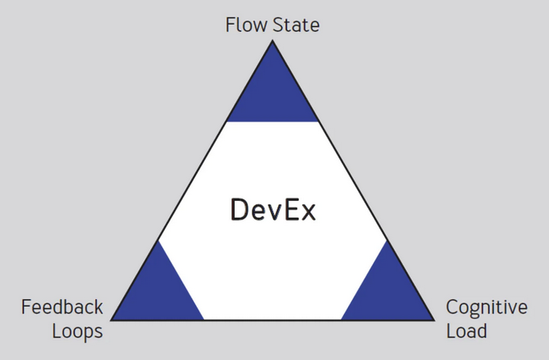
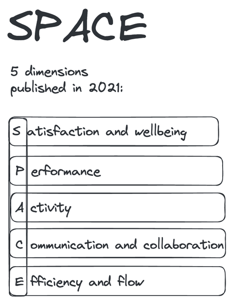

# Developer Experience
La experiencia del desarrollador se refiere a lo fácil o difícil que es para un desarrollador realizar las tareas esenciales necesarias para implementar un cambio.

Las 3 dimensiones fundamentales de la experiencia del desarrollador.

También existen otras tareas esenciales se identifican a continuación.
* **Compilación**: Verificar que los cambios no contienen errores de sintaxis y que compilan.
* **Probar**: Verificar que todas las pruebas automatizadas pasan.
* **Iniciar**: Lanzar de extremo a extremo para simular la ejecución en un entorno desplegado.
* **Depuración (Debug)**: conecte el depurador a la solución iniciada, establezca puntos de interrupción, recorra el código e inspeccione las variables.

## Revisión de la Experiencia del Desarrollador

## Flow State
Los desarrolladores hablan a menudo de "entrar en el flujo" o "estar en la zona". Un estado mental en el que una persona 
que realiza una actividad está totalmente inmersa en una sensación de concentración y plena implicación.

Al inicio del proyecto entrar en el flujo era complicado debido a la falta de pruebas unitarias y documentación.
Con el tiempo y la adopción de buenas prácticas como la creación de pruebas unitarias y la documentación, entrar en el flujo se volvió más sencillo.

## Feedback Loops
Permite una retroalimentación y un aprendizaje más rápidos sobre lo que se está construyendo, lo que a su vez permite una corrección más rápida del rumbo.

**Puntos positivos:**
* Mediante los Pull Requests se obtiene feedback del profesor.
* Al agregar las pruebas unitarias se obtiene feedback inmediato y se previene la introducción de errores.
* Al utilizar herramientas como SonarQube y SonarLint se obtiene feedback sobre la calidad del código.

**Puntos negativos:**
* Al inicio del proyecto no se contaba con pruebas unitarias.
* No existe un pipeline de CI/CD para obtener feedback inmediato.
* Al inicio la única forma de obtener feedback era levantando la aplicación localmente.

## Cognitive Load
Engloba la cantidad de procesamiento mental que necesita un desarrollador para realizar una tarea.

**Puntos positivos**
* Al crear la documentación [README.md](../README.md) para ejecutar la aplicación se reduce la carga cognitiva para nuevos desarrolladores e incluso para los desarrolladores actuales.
* Al agregar las pruebas unitarias se reduce la carga cognitiva para verificar que las nuevas funcionalidades no rompen el código existente.
* Al utilizar herramientas como SonarQube se reduce la carga cognitiva para verificar la calidad del código.
* Realizar los ejercicios de refactorización y limpieza de código reduce la carga cognitiva para entender el código.

**Puntos negativos:**
* El proyecto no contaba con documentación inicial para ejecutar la aplicación, lo cual implicó un esfuerzo adicional para entender como se desplegaba la aplicación.
* La aplicación al ser _legacy_ contiene librerías desactualizadas lo cual implica un mayor esfuerzo para actualizar el proyecto.
* Al inicio no se contaba con pruebas unitarias lo cual implicó un mayor esfuerzo para verificar que las funcionalidades actuales funcionaban correctamente.

# SPACE
Define un marco de referencia para medir la productividad del desarrollador.

Tomando en cuenta el marco anterior.

## Satisfaction and well-being

Inicialmente, la falta de pruebas unitarias, CI/CD y documentación contribuyó a una baja satisfacción. 
Sin embargo, con la adopción de buenas prácticas a lo largo del tiempo, como la implementación de pruebas unitarias y la
mejora de la documentación, la satisfacción ha mejorado significativamente.

## Performance
El rendimiento del proyecto ha mejorado progresivamente a medida que se han actualizado las librerías y se han adoptado
buenas prácticas de desarrollo.

## Activity
Las actividades de desarrollo aumentan a medida que se agregan nuevas funcionalidades y se realizan mejoras en el código.

## Communication and Collaboration
Al ser un proyecto individual no se ha tenido problemas de comunicación y colaboración, únicamente se ha tenido feedback del profesor mediante los Pull Requests.
Sin embargo, si se agregara un nuevo desarrollador al proyecto, la documentación y las pruebas unitarias facilitarían su integración al proyecto.

## Efficiency and Flow
Los cambios implementados en el proyecto han contribuido a una mayor eficiencia y flujo en el desarrollo de nuevas funcionalidades. 
Esto se debe en a la adopción de prácticas como la automatización de pruebas, la mejora de la documentación y la implementación de herramientas de análisis de código, que han optimizado el proceso de desarrollo.

# Oportunidades de Mejora
* **Implementar un pipeline de CI/CD completo:** Esto incluye pipelines para linter, pruebas y despliegue, lo que garantizaría una integración continua y una entrega más rápida y confiable de cambios en el proyecto
* **Optimizar el proceso de despliegue:** Desplegar la aplicación directamente desde el archivo war generado sin depender del servidor Jetty por separado simplificaría el flujo de trabajo de los desarrolladores y aceleraría el tiempo de despliegue.
* **Integrar herramientas como Docker:** Utilizar contenedores Docker facilitaría el despliegue en diferentes entornos y garantizaría la consistencia del entorno de desarrollo, lo que haría que el proceso de desarrollo fuera más ágil y menos propenso a errores.

# Métricas Identificadas
* **Cobertura de pruebas:** Porcentaje de código que está cubierto por pruebas automatizadas.
* **Tiempo de ejecución de pruebas:** Tiempo que tardan en ejecutarse las pruebas automatizadas.
* **Complejidad Ciclomática:** Mide la complejidad del código.
* **Tiempo de inicio:** Tiempo que tarda en iniciar la aplicación.
* **Dificultad de nuevos desarrollos:** Permitir a los desarrolladores evaluar la dificultad de nuevas funcionalidades.

# Uso de GitHub Copilot

## Preguntas sobre el Proyecto
Mediante GitHub Copilot Chat en el IDE, es posible realizar preguntas sobre el proyecto.

En este caso se pregunta sobre qué realiza la clase `LoginDAOImpl`.

## Refactorización de Código

Mediante GitHub Copilot se puede realizar la refactorización de código además de sugerir cambios en el código.

En este caso sugiere realizar 4 cambios los cuales son:
1. Extraer constantes en archivos de configuración.
2. Manejo de excepciones, en este caso se sugiere lanzar una excepción propia en lugar de una excepción genérica.
3. Logging mediante la librería `log4j` o `slf4j`.
4. Inyección de dependencias para el objeto `Client`.

Incluso menciona que existe una vulnerabilidad en el código al dejar credenciales en el código.

## Documentación del Código

Mediante GitHub Copilot se puede generar documentación (javaDoc) para los métodos.

Únicamente al preguntarle al chat de GitHub Copilot usando `/doc`, se genera la documentación para toda la clase.

## Conclusión 
GitHub Copilot es una herramienta que ofrece una amplia gama de funcionalidades para mejorar tanto el desarrollo de software como la experiencia del desarrollador.
Su capacidad para generar código, proporcionar sugerencias y crear documentación automáticamente puede aumentar la productividad de los desarrolladores.

Esto no solo ahorra tiempo al evitar la búsqueda manual de documentación o soluciones, sino que también mejora la calidad 
del código al sugerir mejores prácticas de programación, como la extracción de constantes, manejo adecuado de excepciones, uso de patrones de diseño y 
detección de posibles vulnerabilidades.

# Referencias
* [Developer Experience (DevEx)](https://microsoft.github.io/code-with-engineering-playbook/developer-experience/)
* [A new way to measure developer productivity – from the creators of DORA and SPACE](https://newsletter.pragmaticengineer.com/p/developer-productivity-a-new-framework)
* [DevEx: What Actually Drives Productivity](https://queue.acm.org/detail.cfm?id=3595878)