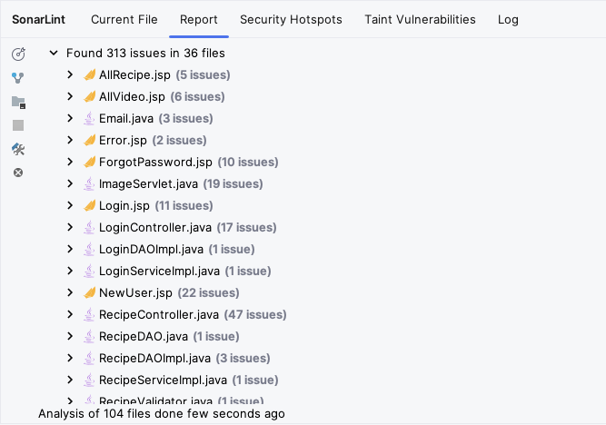

# Análisis Estático

Herramientas de análisis estático utilizadas en el proyecto:
* [SonarLint](https://www.sonarsource.com/products/sonarlint/) - a nivel de IDE (IntelliJ IDEA).
* [SonarQube](https://www.sonarsource.com/open-source-editions/sonarqube-community-edition/) - en cuanto a proyecto.
* [SpotBugs](https://spotbugs.github.io/) - dependencia para el proyecto para análisis de bugs.

# SonarQube
#### Instalación
Instalación de SonarQube Community Edition en Mac:

```bash
brew install sonarqube
```

Ejecución de SonarQube:
```bash
/opt/homebrew/opt/sonarqube/bin/sonar console
```

#### Configuración
Fue necesario actualizar el proyecto a la version de Java a 17 para poder correr SonarQube, debido a que la version 8 no es soportada.


#### Ejecución
```bash
mvn clean verify sonar:sonar \
-Dsonar.projectKey=YummyFoods \
-Dsonar.projectName='YummyFoods' \
-Dsonar.host.url=http://localhost:9000 \
-Dsonar.token=sqp_4cf95173998d4de813c1f19b60441d81cf01ebaf
```

> [!NOTE]
> SonarQube está desplegado localmente, por lo que dejar el token en el repositorio no es un problema de seguridad.

## Resultados
La primera ejecución de SonarQube arrojó los siguientes resultados:


Se ejecutaron en la rama más reciente del proyecto, y se obtuvo la siguiente cantidad de "issues":
* 318 issues con un esfuerzo de 5d 5h

### Código duplicado
Se encontró un 32.4% de código duplicado en 5.6k líneas de código.
* Están principalmente presentes en archivos `.jsp` que contienen código HTML y JavaScript.
* Se encontró interfaces con código duplicado, como `RecipeService` y `RecipeDAO`.

### Seguridad
Se encontraron 14 problemas de seguridad:
* Inyección de SQL.
* El problema predominante es utilizar un objecto persistente en un método `@RequestMapping` en vez de un DTO o un POJO.
* Existen excepciones que no están siendo manejadas/atrapadas, como `NumberFormatException` de `ImageServlet`.

### Mantenibilidad
Se encontraron 180 problemas de mantenibilidad, entre los más comunes:
* Duplicar un valor en vez de definir una constante.
* Utilizar _field injection_ en vez de _constructor injection_.
* Utilizar `@RequestMapping` en vez de `@GetMapping` o `@PostMapping`.
* Tener métodos con mucha Complejidad Cognitiva, `LoginController` sufre de contar con muchos `if` anidados.
* Uso de métodos que estarían obsoletos, como `createBlob()`.
* Casteos innecesarios o redundantes.
* Uso de `System.out` en vez de un logger.

### Fiabilidad
Se encontraron 142 problemas de fiabilidad, entre los más comunes:
* Utilizar _field injection_ en vez de _constructor injection_.
* Introducir nuevas variables en vez de utilizar las existentes.
* Retornar en un `finally` puede causar un `NullPointerException`.
* Los parámetros de una lista deben ser serializables.

# SonarLint
#### Instalación
Se instaló el plugin de SonarLint en IntelliJ IDEA.

#### Configuración
Se configuró SonarLint para que se conecte a SonarQube localmente.


Se configuró el proyecto en SonarLint.


## Resultados
Se econtraron 313 problemas en el 36 archivos analizados, la mayoría de estos archivos son `.jsp` y `.java`.


Entre los problemas encontrados se encuentran:
* Uso de un logger en vez de `System.out`.
* Añadir constructor privado para clases de utilidad.
* Evitar _field injection_ y utilizar _constructor injection_.
* Definir constantes en vez de duplicar el valor.
* Entidades persistentes no deben ser utilizadas como argumentos de `@RequestMapping`.

Se encontraron 126 problemas de seguridad, la mayoría de estos problemas son:
* Imprimir todo el stack trace de un error, `e.printStackTrace()`.
* Permitir métodos HTTP seguros e inseguros.

# SpotBugs
#### Instalación
Se añadió la dependencia de SpotBugs en el archivo `pom.xml`:
```xml
<dependency>
    <groupId>com.github.spotbugs</groupId>
    <artifactId>spotbugs</artifactId>
    <version>${version}</version>
</dependency>
```

Y se agregó el plugin de SpotBugs en el archivo `pom.xml`:
```xml
<plugin>
    <groupId>com.github.spotbugs</groupId>
    <artifactId>spotbugs-maven-plugin</artifactId>
    <version>${version}</version>
</plugin>
```

#### Ejecución
```bash
mvn spotbugs:check
```
o
```bash
mvn spotbugs:gui
```

## Resultados
SpotBugs encontró 20 bugs en el proyecto.


Entre los bugs encontrados se encuentran:
* `NP_GUARANTEED_DEREF_ON_EXCEPTION_PATH` - `NullPointerException` garantizada en un camino de excepción.
* `J2EE_STORE_OF_NON_SERIALIZABLE_OBJECT_INTO_SESSION` - Almacenar un objeto no serializable en la sesión.
* `EI_EXPOSE_REP` - Exponer un objeto mutable a un cliente.
* `UC_USELESS_CONDITION` - Condición sin efecto.

# Conclusiones
Se encontraron varios problemas en el proyecto, principalmente en cuanto a seguridad y mantenibilidad.
Gracias a estas herramientas se pueden identificar y corregir estos problemas antes de que se conviertan en un problema mayor y proveen una guía para mejorar la calidad del código.
Además pueden dar un estimado del tiempo que tomaría corregir estos problemas, en este caso, 5 días y 5 horas.

Al complementar estas herramientas las unas con las otras, se puede tener una visión más completa de los problemas en el proyecto y se pueden corregir de manera más eficiente. Por ejemplo, SpotBugs encontró 20 bugs, mientras que SonarLint encontró 313 problemas, y SonarQube encontró 318 problemas. Al corregir los problemas de SonarLint, se pueden corregir los problemas de SpotBugs y SonarQube, y así sucesivamente.

Cada herramienta provee una ventaja, SonarLint provee un análisis mientras el desarrollador escribe el código, SpotBugs provee un análisis al compilar y ejecutar una meta del proyecto, que puede ser integrado en un pipeline de CI/CD, y SonarQube provee un análisis más profundo del proyecto, y también puede ser integrado en un pipeline de CI/CD.
